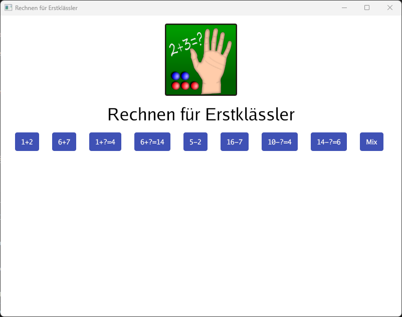
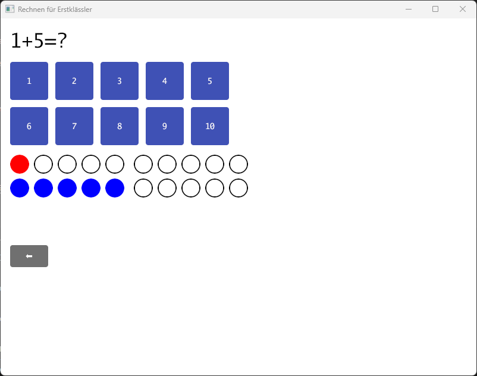

# Rechnen Für Erstklässler

This is golang/gioui remake of my old android application written in java that I have made for my kids
to learn simple maths for 1st grade scholl kids.

Because gioui application can be compiled to static html (webassemble) you can try the app also directly 
in your browser

<a href="https://xdobry.github.io/rechnenfuererstklaessler/">Try the App directly in your Browser!</a>

I have done it to learn golang und gioui. I wanted to test if gioui can replace html based
framework for ui as react.
The result are positive.
The application are much shorter and run on multiple platforms (windows und webasm) without problems.

The app was quite popular for some time on google store and have over 100.000 installations.
I suppose that many other similar simple maths apps was done after it.

# Open Points

The html variant does not show all utf8 characters.

# Windows compilation

running

    go run .\cmd\rechnenfuererstklaessler\  

compile for windows

    go build -ldflags="-H windowsgui" .\cmd\rechnerfuererstklaessler\  

# WASM Compilation

Install giogo (need to be done only once)

    go install gioui.org/cmd/gogio@latest

Compile

    gogio -target js .\cmd\rechnenfuererstklaessler\

Serve

    cd .\rechnenfuererstklaessler\
    python -m http.server

Luch the app using http://localhost:8000